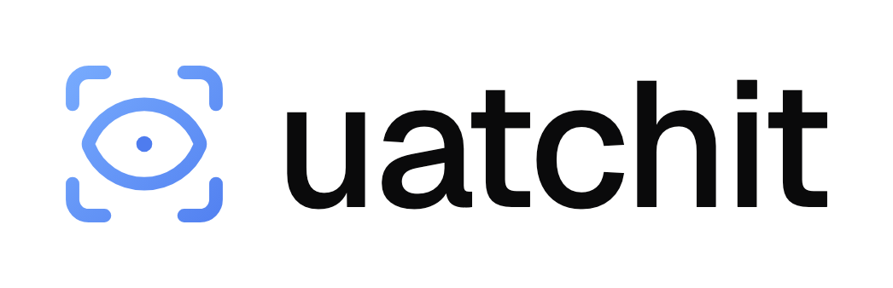
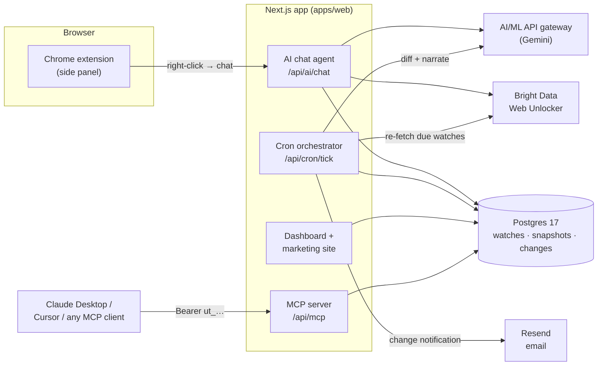

<div align="center">

<picture>
  <source media="(prefers-color-scheme: dark)" srcset="logo-pack/lockup/uatchit-lockup-on-dark.png">
  
</picture>

### Right-click any web page. Watch it forever.

uatchit turns any page into a structured, AI-monitored data source.
It infers what matters, watches for changes, and narrates them in plain English —
**to your inbox, or to your agents.**

### [▶ Try it live — uatchit.com](https://uatchit.com)

<br>


*Built for the Bright Data Hackathon*

</div>

---

## The idea

Monitoring a web page today means one of two bad options: brittle CSS-selector scrapers that break the moment a layout shifts, or "check this page" reminders you ignore. uatchit replaces both.

You **right-click a page** → an AI side panel opens → a model reads the page and proposes a **structured schema** of the fields worth tracking (prices, headlines, filing dates, CVE scores, job counts…). You confirm or refine it in plain English. From then on, uatchit re-fetches on a schedule, **diffs** each snapshot, and **narrates** what changed like a sentence — not a wall of red/green.

The twist: every watch is **also an [MCP](https://modelcontextprotocol.io) feed**. The same diff that lands in your inbox is available to Claude Desktop, Cursor, or any agent as structured, fresh, diff-aware data. Humans and agents read the same source of truth.

## How it works

```
  1. Right-click  ──▶  2. AI infers a schema  ──▶  3. Diffs that read like a sentence
  "Watch with          Gemini reads the page,       Bright Data re-fetches on a cadence.
   uatchit"            proposes fields to track,    uatchit narrates the change, then
                       you refine in plain English. pushes it to email + your MCP feed.
```

No selectors. No XPath. No "wait, what changed?" emails at 2 a.m.

## Who it's for

| | Watches | Example delta |
|---|---|---|
| **Go-to-market** | Competitor pricing, feature launches, positioning | `Plus tier $8 → $10, since 3 days ago` |
| **Finance & legal** | SEC filings, regulatory pages, 10-Q updates | `New 8-K filing — Q3 guidance, risk: material` |
| **Security & ops** | Status pages, CVE feeds, policy docs | `CVE-2026-2104 → HIGH, score 8.6` |

## Architecture

A single-deployable monolith: one Next.js app hosts the dashboard, the chat agent, the cron orchestrator, **and** the MCP server. A thin Chrome side-panel extension is the capture surface. Postgres is the only stateful dependency.



**The watch lifecycle** (`apps/web/src/server/tick-one-watch.ts`): fetch page markdown via Bright Data → extract field values against the stored schema → diff vs. the last snapshot → if changed, narrate via the LLM, persist a `change` row, and email the user. Bounded concurrency (5 in flight, ≤20 per tick).

**Schema inference** (`apps/web/src/lib/infer-schema.ts`): a single universal "what would change on this page?" prompt produces a free-form schema — no per-site templates. This is the result of an aggressive simplification pass (an earlier multi-tier JSON-LD/cheerio/archetype pipeline was deleted in favor of one prompt — roughly 2× faster and 3–8× cheaper at ~$0.005/call).

## Tech stack

| Layer | Choice |
|---|---|
| Web | Next.js 15 (App Router), React 19, TypeScript 5.6 |
| UI | Tailwind v4, shadcn/ui, Geist, Framer Motion |
| Auth | Auth.js v5 — passwordless magic-link + 6-digit OTP (for the extension) |
| Database | Postgres 17 + Drizzle ORM |
| AI | `openai` SDK pointed at the AI/ML API gateway — Gemini Flash-Lite (inference/extraction/narration) + Gemini Pro (chat agent) |
| Scraping | Bright Data Web Unlocker |
| Email | Resend + React Email |
| Agents | MCP via `mcp-handler` + `@modelcontextprotocol/sdk` |
| Extension | Plasmo (Manifest V3), side-panel only |

## Every watch is an MCP feed

Generate a personal token in **Settings → MCP** (tokens are `ut_`-prefixed and stored hashed). Then point any MCP client at the server:

```bash
# Read your watches as structured data
curl -H "Authorization: Bearer ut_your_token" \
     https://app.uatchit.com/api/mcp
```

Connect it to **Claude Desktop** via the remote-MCP bridge:

```jsonc
// claude_desktop_config.json
{
  "mcpServers": {
    "uatchit": {
      "command": "npx",
      "args": [
        "-y", "mcp-remote",
        "https://app.uatchit.com/api/mcp",
        "--header", "Authorization: Bearer ut_your_token"
      ]
    }
  }
}
```

The server exposes five read-only tools: `list_watches`, `get_watch`, `get_latest_snapshot`, `get_changes`, and `get_schema`.

## Quick start

**Prerequisites:** Node 20+, a local Postgres 17, and API keys for [Resend](https://resend.com), the [AI/ML API](https://aimlapi.com), and [Bright Data](https://brightdata.com).

```bash
git clone https://github.com/GPT-64590/uatchit.git
cd uatchit
npm install

cp .env.example .env        # then fill in DATABASE_URL + the API keys
npm run db:migrate          # create the schema

npm run dev                 # web app → http://localhost:3000
npm run cron:dev            # (separate terminal) re-fetch watches every 60s
```

**Load the extension:** in `apps/extension`, run `npm run dev`, then load the built directory at `chrome://extensions` (Developer mode → *Load unpacked*).

See [`docs/DEPLOYMENT.md`](docs/DEPLOYMENT.md) for the production deploy (Docker Compose + Cloudflare Tunnel) and [`docs/ARCHITECTURE.md`](docs/ARCHITECTURE.md) for a deeper system walkthrough.

## Project structure

```
uatchit/
├── apps/
│   ├── web/              # Next.js app — dashboard, chat agent, cron, MCP server
│   │   ├── src/app/      # routes: marketing, /app dashboard, /api/*
│   │   ├── src/db/       # Drizzle schema + migrations
│   │   ├── src/lib/      # AI pipeline (infer · extract · narrate), env, auth helpers
│   │   └── src/server/   # watch orchestration (tick-one-watch, create-watch)
│   └── extension/        # Plasmo MV3 side-panel extension
├── docs/                 # architecture + deployment guides
├── logo-pack/            # brand assets
└── scripts/              # cron driver, logo generation
```

## License

MIT — see [`LICENSE`](LICENSE).
